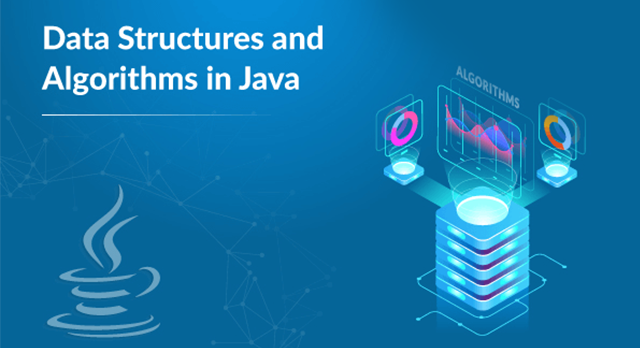

<p align="center"></p>

# Java : Data Structures And Algorithms(DSA)
The data structures and algorithms are implemented in java.
This is a collection of data structures and algorithms I am implementing for my educational purpose. The code is optimized and is written to be correct and readable. The data structures and algorithms are tested and, believed to be correct.

## Tests

### Compile
for compiling the program write down:
```
	javac file_name.java
```

### Run
to run the program write down:
```
	java file_name
```

# What's been implemented:

## Table of Contents

- Data Structures

## Data Structures

- Array
	- One Dimensional Array
		- Traversing
		- Insertion
		- Deletion
	- Two Dimensional Array
	- Three Dimensional Array

- Linked List
	- Singly Linked List
		- Traversing
		- Insertion

- Notes

## Contributing
Keep contributing your idea or programs to this project.